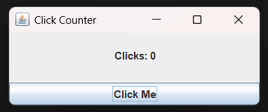
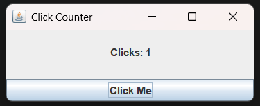

## Exercise 1: Click Counter Application

### Description & Goal

Create a simple GUI application that tracks how many times a user clicks a button and displays the count in real time. This exercise reinforces the basics of Swing components and event handling.

### Code Breakdown

**Part 1: Field Declarations**
Define the UI components and a counter variable.

```java
public class ClickCounterApp extends JFrame implements ActionListener {
    private JLabel counterLabel;    // Displays the click count
    private JButton clickButton;    // Button to register clicks
    private int count = 0;          // Stores the current count
}
```

*Explanation:* We declare a `JLabel` for showing the count, a `JButton` for clicks, and an integer `count` initialized to 0.

**Part 2: Constructor Setup**
Initialize and arrange components in the window.

```java
public ClickCounterApp() {
    setTitle("Click Counter");
    counterLabel = new JLabel("Clicks: 0", SwingConstants.CENTER);
    clickButton = new JButton("Click Me");
    clickButton.addActionListener(this);

    setLayout(new BorderLayout());
    add(counterLabel, BorderLayout.CENTER);
    add(clickButton, BorderLayout.SOUTH);
}
```

*Explanation:* In the constructor we set the title, create the label and button, attach an `ActionListener` to the button, choose a `BorderLayout`, and place the label at center and button at bottom.

**Part 3: Event Handling**
Update count and label text when the button is clicked.

```java
@Override
public void actionPerformed(ActionEvent e) {
    count++;  // Increment the click counter
    counterLabel.setText("Clicks: " + count);
}
```

*Explanation:* The `actionPerformed` method is called on each click. We increase `count` by one and refresh the label text to reflect the new value.

**Part 4: Application Entry Point**
Launch the GUI on the Event Dispatch Thread.

```java
public static void main(String[] args) {
    SwingUtilities.invokeLater(() -> new ClickCounterApp().setVisible(true));
}
```

*Explanation:* Using `SwingUtilities.invokeLater` ensures thread safety by creating and showing the GUI on the Swing event thread.
---
### output of the code:



