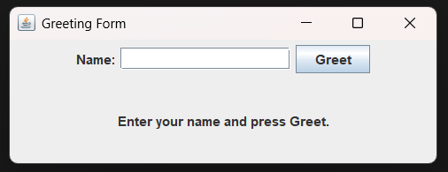
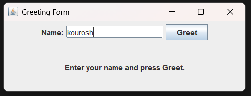
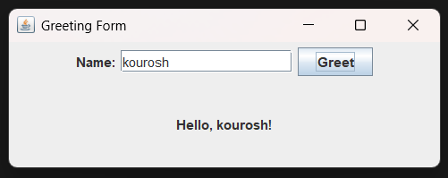

## Exercise 2: Greeting Form Application

### Description & Goal

Create a GUI form where the user enters their name into a text field and clicks a button to display a personalized greeting. This exercise practices input handling, text fields, and dynamic label updates.

### Code Breakdown

**Part 1: Field Declarations**
Define the input, button, and label components.

```java
public class GreetingFormApp extends JFrame implements ActionListener {
    private JTextField nameField;   // Field for user input
    private JButton greetButton;    // Button to trigger greeting
    private JLabel messageLabel;    // Label to display greeting
}
```

*Explanation:* We declare a `JTextField` for entering the name, a `JButton` for submitting, and a `JLabel` for showing messages.

**Part 2: Constructor Setup**
Initialize components and arrange them using a simple layout.

```java
public GreetingFormApp() {
    setTitle("Greeting Form");
    nameField = new JTextField(15);
    greetButton = new JButton("Greet");
    messageLabel = new JLabel("Enter your name and press Greet.", SwingConstants.CENTER);

    greetButton.addActionListener(this);

    JPanel inputPanel = new JPanel();
    inputPanel.add(new JLabel("Name:"));
    inputPanel.add(nameField);
    inputPanel.add(greetButton);

    setLayout(new BorderLayout());
    add(inputPanel, BorderLayout.NORTH);
    add(messageLabel, BorderLayout.CENTER);
}
```

*Explanation:* In the constructor, we set the title, instantiate the text field, button, and label, attach the listener, group the input components in a `JPanel`, and use `BorderLayout` to place the input panel at the top and the message label in the center.

**Part 3: Event Handling**
Read the text field and update the label when the button is clicked.

```java
@Override
public void actionPerformed(ActionEvent e) {
    String name = nameField.getText().trim();
    if (name.isEmpty()) {
        messageLabel.setText("Please enter a name.");
    } else {
        messageLabel.setText("Hello, " + name + "!");
    }
}
```

*Explanation:* On button click, we get the trimmed input. If empty, prompt the user; otherwise, display "Hello, {name}!".

**Part 4: Application Entry Point**
Start the form on the Event Dispatch Thread.

```java
public static void main(String[] args) {
    SwingUtilities.invokeLater(() -> new GreetingFormApp().setVisible(true));
}
```

*Explanation:* We use `invokeLater` to ensure the GUI is created and manipulated on the Event Dispatch Thread, then display the frame.
---
### output of the code:



