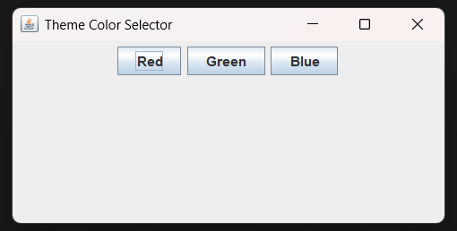
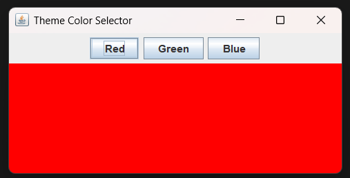
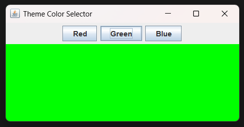
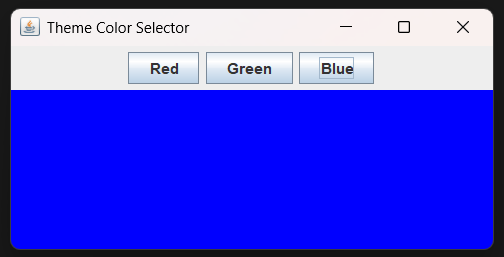

## Exercise 3: Theme Color Selector Application

### Description & Goal

Create a UI with several color buttons ("Red", "Green", "Blue", ...) that, when clicked, change the background color of the main panel. This exercise reinforces component integration, action commands, and background styling.

### Code Breakdown

**Part 1: Field Declarations**
Define the main panel and color buttons.

```java
public class ThemeColorSelectorApp extends JFrame implements ActionListener {
    private JPanel mainPanel;      // The panel whose background will change
    private JButton redButton;     // Button to select red theme
    private JButton greenButton;   // Button to select green theme
    private JButton blueButton;    // Button to select blue theme
}
```

*Explanation:* We declare a `JPanel` to hold the background, and three `JButton` instances for the color options.

**Part 2: Constructor Setup**
Initialize components, set action commands, and arrange using `BorderLayout`.

```java
public ThemeColorSelectorApp() {
    setTitle("Theme Color Selector");

    mainPanel = new JPanel();

    redButton = new JButton("Red");
    greenButton = new JButton("Green");
    blueButton = new JButton("Blue");

    redButton.setActionCommand("RED");
    greenButton.setActionCommand("GREEN");
    blueButton.setActionCommand("BLUE");

    redButton.addActionListener(this);
    greenButton.addActionListener(this);
    blueButton.addActionListener(this);

    JPanel buttonPanel = new JPanel();
    buttonPanel.add(redButton);
    buttonPanel.add(greenButton);
    buttonPanel.add(blueButton);

    setLayout(new BorderLayout());
    add(buttonPanel, BorderLayout.NORTH);
    add(mainPanel, BorderLayout.CENTER);
}
```

*Explanation:* In the constructor, we instantiate the panel and buttons, assign action commands to differentiate them in the listener, attach the same `ActionListener`, and place the buttons at the top with the main panel filling the center.

**Part 3: Event Handling**
Change the `mainPanel` background based on the button clicked.

```java
@Override
public void actionPerformed(ActionEvent e) {
    switch (e.getActionCommand()) {
        case "RED":   mainPanel.setBackground(Color.RED);   break;
        case "GREEN": mainPanel.setBackground(Color.GREEN); break;
        case "BLUE":  mainPanel.setBackground(Color.BLUE);  break;
    }
}
```

*Explanation:* We check the action command of the event and apply the corresponding `Color` to the panel's background.

**Part 4: Application Entry Point**
Launch the application safely on the Swing thread.

```java
public static void main(String[] args) {
    SwingUtilities.invokeLater(() -> new ThemeColorSelectorApp().setVisible(true));
}
```

*Explanation:* We use `invokeLater` to ensure the GUI is created and manipulated on the Event Dispatch Thread, then display the frame.
---
### output of the code:





