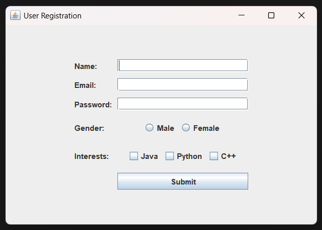

## Exercise 4: User Registration Form Application

### Description & Goal

Design a comprehensive registration form using `GridBagLayout`. Students will arrange multiple Swing components—text fields, password field, radio buttons, checkboxes, and a submit button—in a responsive grid. The goal is to practice advanced layout management and component integration.

### Code Breakdown

**Part 1: Field Declarations**
Define all UI components and layout constraints.

```java
public class RegistrationFormApp extends JFrame implements ActionListener {
    private JTextField txtName;           // User name input
    private JTextField txtEmail;          // User email input
    private JPasswordField txtPassword;   // Password input
    private JRadioButton rbMale, rbFemale;  // Gender selection
    private JCheckBox cbJava, cbPython, cbCpp;  // Interests selection
    private JButton btnSubmit;            // Submit form button
    private GridBagConstraints gbc;       // Layout constraints
}
```

*Explanation:* We declare fields for name, email, and password inputs; radio buttons for gender; checkboxes for interests; a submit button; and `GridBagConstraints` for positioning.

**Part 2: Constructor Setup**
Initialize components, configure `GridBagLayout`, and add items.

```java
public RegistrationFormApp() {
    setTitle("User Registration");
    setSize(500, 350);
    setDefaultCloseOperation(EXIT_ON_CLOSE);
    setLocationRelativeTo(null);

    JPanel panel = new JPanel(new GridBagLayout());
    gbc = new GridBagConstraints();
    gbc.insets = new Insets(5, 5, 5, 5);
    gbc.fill = GridBagConstraints.HORIZONTAL;

    // Row 0: Name label & field
    gbc.gridx = 0; gbc.gridy = 0;
    panel.add(new JLabel("Name:"), gbc);
    gbc.gridx = 1;
    txtName = new JTextField(20);
    panel.add(txtName, gbc);

    // Row 1: Email label & field
    gbc.gridx = 0; gbc.gridy = 1;
    panel.add(new JLabel("Email:"), gbc);
    gbc.gridx = 1;
    txtEmail = new JTextField(20);
    panel.add(txtEmail, gbc);

    // Row 2: Password label & field
    gbc.gridx = 0; gbc.gridy = 2;
    panel.add(new JLabel("Password:"), gbc);
    gbc.gridx = 1;
    txtPassword = new JPasswordField(20);
    panel.add(txtPassword, gbc);

    // Row 3: Gender selection
    gbc.gridx = 0; gbc.gridy = 3;
    panel.add(new JLabel("Gender:"), gbc);
    gbc.gridx = 1;
    rbMale = new JRadioButton("Male"); rbFemale = new JRadioButton("Female");
    ButtonGroup bg = new ButtonGroup(); bg.add(rbMale); bg.add(rbFemale);
    JPanel genderPanel = new JPanel(); genderPanel.add(rbMale); genderPanel.add(rbFemale);
    panel.add(genderPanel, gbc);

    // Row 4: Interests selection
    gbc.gridx = 0; gbc.gridy = 4;
    panel.add(new JLabel("Interests:"), gbc);
    gbc.gridx = 1;
    cbJava = new JCheckBox("Java"); cbPython = new JCheckBox("Python"); cbCpp = new JCheckBox("C++");
    JPanel interestPanel = new JPanel();
    interestPanel.add(cbJava); interestPanel.add(cbPython); interestPanel.add(cbCpp);
    panel.add(interestPanel, gbc);

    // Row 5: Submit button
    gbc.gridx = 1; gbc.gridy = 5;
    gbc.anchor = GridBagConstraints.CENTER;
    btnSubmit = new JButton("Submit");
    btnSubmit.addActionListener(this);
    panel.add(btnSubmit, gbc);

    add(panel);
}
```

*Explanation:* We configure `GridBagLayout` with padding, add labels and inputs sequentially by grid coordinates, and group related radio and checkbox components in sub-panels.

**Part 3: Event Handling**
Collect input values on submit and display them.

```java
@Override
public void actionPerformed(ActionEvent e) {
    String name = txtName.getText();
    String email = txtEmail.getText();
    String gender = rbMale.isSelected() ? "Male" : rbFemale.isSelected() ? "Female" : "Unspecified";
    String interests = "";
    if (cbJava.isSelected()) interests += "Java ";
    if (cbPython.isSelected()) interests += "Python ";
    if (cbCpp.isSelected()) interests += "C++ ";

    JOptionPane.showMessageDialog(this,
        "Name: " + name + "\n" +
        "Email: " + email + "\n" +
        "Gender: " + gender + "\n" +
        "Interests: " + interests,
        "Registration Details", JOptionPane.INFORMATION_MESSAGE);
}
```

*Explanation:* On button press, we read each field's value, determine selected options, and show a summary dialog.

**Part 4: Application Entry Point**
Run the form on the Swing event thread.

```java
public static void main(String[] args) {
    SwingUtilities.invokeLater(() -> new RegistrationFormApp().setVisible(true));
}
```

*Explanation:* Ensures safe creation and display of the GUI on the Event Dispatch Thread.
---
### output of the code:



